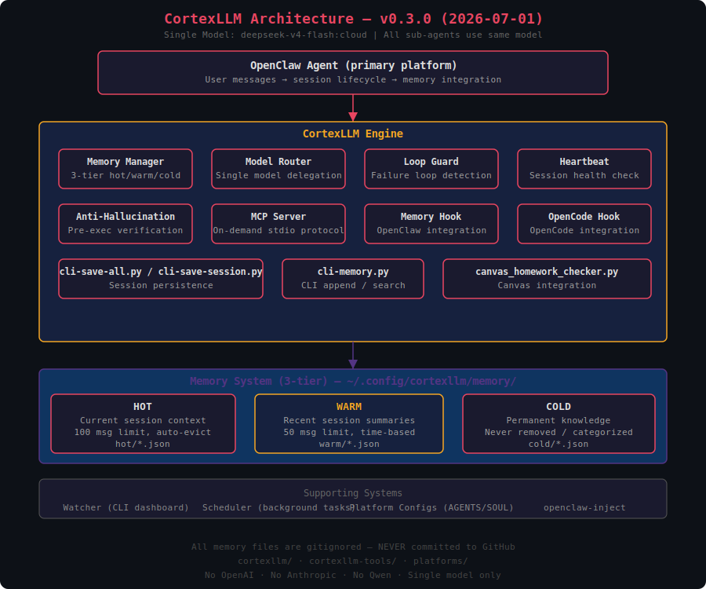

# CortexLLM — v0.3.0 (2026-07-01)

**Unified memory system for AI agents.** Single model architecture — `deepseek-v4-flash:cloud`.

## Architecture



See [cortexllm/README.md](cortexllm/README.md) for full feature list, data flow, and details.

## Quick Start

```bash
python3 cortexllm-tools/cli-save-all.py          # Save sessions to memory
python3 cortexllm-tools/cli-memory.py append text   # Add to hot memory
python3 cortexllm-tools/cli-memory.py search query  # Search memory
watcher status                                      # Token dashboard
```

## What It Does

- **Persistent memory** across sessions (hot/warm/cold 3-tier)
- **Sub-agent delegation** using same model (splits compute)
- **Health monitoring** — heartbeat, loop guard, anti-hallucination
- **Token tracking** — real usage from session files
- **Background tasks** — scheduler for recurring work

## Model

- **Only model**: `deepseek-v4-flash:cloud` via Ollama
- No OpenAI, Anthropic, or other models
- Sub-agents use the same model

## Structure

```
cortexllm/              → Engine (8 .py files)
cortexllm-tools/        → CLI tools (cli-memory, cli-save-all, cli-save-session)
platforms/              → Platform configs (AGENTS.md, SOUL.md)
```

## Install

```bash
cp -r cortexllm/ ~/.openclaw/cortexllm/
cp cortexllm-tools/* ~/.local/bin/
```

Requires: Python 3, Ollama at http://127.0.0.1:11434
